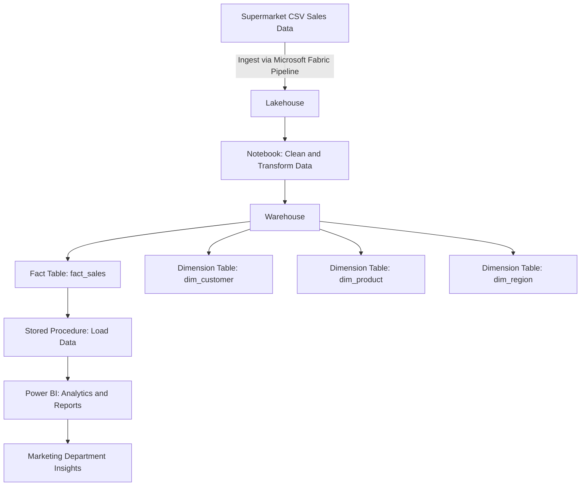

Here’s a storyline and architecture diagram for the goal of loading CSV sales data into a Lakehouse for analysis by a supermarket’s marketing department:

### **Goal: Analyze Sales Data for Insights**  
The supermarket’s marketing department wants to analyze daily sales data captured across multiple regions. Their objective is to:
1. **Understand sales trends** across various categories (e.g., Beverages, Snacks, Eggs, etc.).
2. **Identify top-selling items** and customers in each region.
3. **Determine monthly and yearly sales patterns** to optimize marketing strategies.
4. **Evaluate customer preferences** by city and region.
5. **Measure the impact of discounts** on overall profits and losses.

### **Solution:**
1. **Load Data**: The daily sales data, collected in CSV files, will be loaded into Microsoft Fabric’s Lakehouse using pipelines and transformed into warehouse tables.
   
2. **Warehouse Schema**: Fact tables (e.g., `fact_sales`) and dimension tables (e.g., `dim_customer`, `dim_product`, `dim_region`) will be created in the Data Warehouse to efficiently query and analyze the data.

3. **Stored Procedures**: Create stored procedures to load data from the CSV files into the warehouse tables based on parameters such as year and city.

4. **Power BI Reports**: The marketing team will use Power BI to generate visual reports that analyze total sales, top customers, and high-performing products.

---

### Mermaid Architecture Diagram:



This architecture illustrates how data flows from the raw CSV into the Lakehouse, gets processed and loaded into fact and dimension tables in the warehouse, and ultimately generates insights through Power BI.

### PART 1: Load and Transform Sales Data
#### Step 1: Load Data into Microsoft Fabric Lakehouse
- **Goal:** Load the provided CSV file (sales data) into a Lakehouse.
- **Solution:**

    1.**Create Lakehouse and folder**
  1. To get data file from Http : ``https://raw.githubusercontent.com/mofaizal/microsoft_fabric_playground/refs/heads/main/dataset/sales_data_05092024.csv``
  2. **Create a Fabric pipeline:** Set up a data pipeline that monitors the storage (where the CSV files are uploaded). This pipeline will automate the data load.
  3. **Notebook integration:** Use a notebook to automate transformations on the raw CSV data and load it into a table in the Lakehouse.

  ```
  # Sample code to load CSV to Lakehouse
  df = spark.read.format("csv").option("header", "true").load("Files/data/*.csv")
  df.write.format("delta").saveAsTable("lakehouse_table")
  ```

  3. Schedule the pipeline to run daily or when new files are detected.

#### Step 2: Create Warehouse 
- Create Warehouse 

#### Step 2: Create Fact and Dimension Tables in the Warehouse
- **Goal:** Use the data schema and create a star schema in the warehouse.
- **Solution:**
Fact Table: FactSales, storing transactional sales data.
Dimension Tables:
dim_customer: Customer details
dim_category: Category and sub-category
dim_region: City and state

1. Create Schema First
2. New SQL Query
3. 
To keep your data well-organized, start by creating a schema:

#### Create Fact and Dim Tables 

```SQL

IF NOT EXISTS (SELECT * FROM sys.schemas WHERE name = 'SalesData')
BEGIN
    EXEC('CREATE SCHEMA SalesData');
END;
GO

-- Create fact_sales table
IF NOT EXISTS (SELECT * FROM sys.tables WHERE name = 'fact_sales' AND SCHEMA_NAME(schema_id) = 'SalesData')
BEGIN
    CREATE TABLE SalesData.fact_sales (
        order_id VARCHAR(50),
        customer_id INT,
        category_id INT,
        sales DECIMAL(10,2),
        order_date DATE,
        region_id INT,
        discount VARCHAR(50)
    );
END;
GO

-- Create dim_customer table
IF NOT EXISTS (SELECT * FROM sys.tables WHERE name = 'dim_customer' AND SCHEMA_NAME(schema_id) = 'SalesData')
BEGIN
    CREATE TABLE SalesData.dim_customer (
        customer_id INT,
        customer_name VARCHAR(100)
    );
END;
GO

-- Create dim_category table
IF NOT EXISTS (SELECT * FROM sys.tables WHERE name = 'dim_category' AND SCHEMA_NAME(schema_id) = 'SalesData')
BEGIN
    CREATE TABLE SalesData.dim_category (
        category_id INT,
        category_name VARCHAR(50),
        sub_category VARCHAR(50)
    );
END;
GO

-- Create dim_region table
IF NOT EXISTS (SELECT * FROM sys.tables WHERE name = 'dim_region' AND SCHEMA_NAME(schema_id) = 'SalesData')
BEGIN
    CREATE TABLE SalesData.dim_region (
        region_id INT,
        city VARCHAR(100),
        state VARCHAR(100),
        region VARCHAR(50)
    );
END;
GO
```

#### Insert Data Into 

```SQL

INSERT INTO SalesData.dim_customer (customer_id, customer_name)
SELECT DISTINCT 
    DENSE_RANK() OVER (ORDER BY Customer_Name) AS customer_id,
    Customer_Name
FROM [marketing].[dbo].[lakehouse_table];

INSERT INTO SalesData.dim_category (category_id, category_name, sub_category)
SELECT DISTINCT 
    DENSE_RANK() OVER (ORDER BY Category, Sub_Category) AS category_id,
    Category,
    Sub_Category
FROM [marketing].[dbo].[lakehouse_table];

INSERT INTO SalesData.dim_region (region_id, city, state, region)
SELECT DISTINCT 
    DENSE_RANK() OVER (ORDER BY City, State, Region) AS region_id,
    City, 
    State, 
    Region
FROM [marketing].[dbo].[lakehouse_table];


```

```SQL

CREATE VIEW SalesData.vw_fact_sales_staging
AS
SELECT 
    ls.Order_ID,
    dc.customer_id,
    dcat.category_id,
    ls.Sales,
    ls.Order_Date,
    dr.region_id,
    ls.Discount
FROM [marketing].[dbo].[lakehouse_table] ls
INNER JOIN SalesData.dim_customer dc ON ls.Customer_Name = dc.customer_name
INNER JOIN SalesData.dim_category dcat ON ls.Category = dcat.category_name AND ls.Sub_Category = dcat.sub_category
INNER JOIN SalesData.dim_region dr ON ls.City = dr.city AND ls.State = dr.state AND ls.Region = dr.region;

```

```SQL
CREATE OR ALTER PROCEDURE SalesData.LoadSalesData
    @OrderYear INT
AS
BEGIN
    -- Insert data into dim_customer
    INSERT INTO SalesData.dim_customer (customer_id, customer_name)
    SELECT DISTINCT 
        DENSE_RANK() OVER (ORDER BY Customer_Name) AS customer_id,
        Customer_Name
    FROM [marketing].[dbo].[lakehouse_table]
    WHERE YEAR(Order_Date) = @OrderYear;

    -- Insert data into dim_category
    INSERT INTO SalesData.dim_category (category_id, category_name, sub_category)
    SELECT DISTINCT 
        DENSE_RANK() OVER (ORDER BY Category, Sub_Category) AS category_id,
        Category,
        Sub_Category
    FROM [marketing].[dbo].[lakehouse_table]
    WHERE YEAR(Order_Date) = @OrderYear;

    -- Insert data into dim_region
    INSERT INTO SalesData.dim_region (region_id, city, state, region)
    SELECT DISTINCT 
        DENSE_RANK() OVER (ORDER BY City, State, Region) AS region_id,
        City, 
        State, 
        Region
    FROM [marketing].[dbo].[lakehouse_table]
    WHERE YEAR(Order_Date) = @OrderYear;

    -- Insert data into fact_sales using the view
    INSERT INTO SalesData.fact_sales (order_id, customer_id, category_id, sales, order_date, region_id, discount)
    SELECT * FROM SalesData.vw_fact_sales_staging
    WHERE YEAR(Order_Date) = @OrderYear;
END;
```

```SQL
 EXEC SalesData.LoadSalesData 2020
```

```SQL
    SELECT * FROM SalesData.fact_sales
    WHERE YEAR(order_date) = 2020;
```


Let's review the tables and the queries based on the goals you've outlined:

### Tables Recap:
- **`fact_sales`**: Contains order details, customer, category, region, sales amount, order date, and discount.
- **`dim_customer`**: Contains customer details.
- **`dim_category`**: Contains category and sub-category details.
- **`dim_region`**: Contains city, state, and region details.

Each goal can be addressed by querying the `fact_sales` table and joining the relevant dimension tables. I will break down each goal and the corresponding query, ensuring the tables contain all the necessary columns to support these queries.

#### 1. **Understand Sales Trends Across Various Categories (e.g., Beverages, Snacks, Eggs, etc.)**

**Required columns**:
- From `fact_sales`: `sales`, `order_date`
- From `dim_category`: `category_name`

**Query**:
```sql
SELECT 
    dc.category_name, 
    YEAR(fs.order_date) AS year, 
    MONTH(fs.order_date) AS month,
    SUM(fs.sales) AS total_sales
FROM 
    SalesData.fact_sales fs
INNER JOIN 
    SalesData.dim_category dc ON fs.category_id = dc.category_id
GROUP BY 
    dc.category_name, YEAR(fs.order_date), MONTH(fs.order_date)
ORDER BY 
    year DESC, month DESC, total_sales DESC;
```

This query provides monthly sales trends across different categories.

#### 2. **Identify Top-Selling Items and Customers in Each Region**

**Required columns**:
- From `fact_sales`: `sales`
- From `dim_customer`: `customer_name`
- From `dim_region`: `city`, `state`, `region`

**Query**:
```sql
SELECT 
    dc.customer_name, 
    dr.city, 
    dr.state, 
    dr.region, 
    SUM(fs.sales) AS total_sales
FROM 
    SalesData.fact_sales fs
INNER JOIN 
    SalesData.dim_customer dc ON fs.customer_id = dc.customer_id
INNER JOIN 
    SalesData.dim_region dr ON fs.region_id = dr.region_id
GROUP BY 
    dc.customer_name, dr.city, dr.state, dr.region
ORDER BY 
    total_sales DESC;
```

This query gives a breakdown of the top-selling customers by city, state, and region.

#### 3. **Determine Monthly and Yearly Sales Patterns to Optimize Marketing Strategies**

**Required columns**:
- From `fact_sales`: `sales`, `order_date`

**Query**:
```sql
SELECT 
    YEAR(fs.order_date) AS year, 
    MONTH(fs.order_date) AS month, 
    SUM(fs.sales) AS total_sales
FROM 
    SalesData.fact_sales fs
GROUP BY 
    YEAR(fs.order_date), MONTH(fs.order_date)
ORDER BY 
    year DESC, month DESC;
```

This query shows monthly and yearly sales patterns, allowing for analysis of seasonal trends.

#### 4. **Evaluate Customer Preferences by City and Region**

**Required columns**:
- From `fact_sales`: `sales`
- From `dim_customer`: `customer_name`
- From `dim_region`: `city`, `state`, `region`

**Query**:
```sql
SELECT 
    dc.customer_name, 
    dr.city, 
    dr.state, 
    dr.region, 
    SUM(fs.sales) AS total_sales
FROM 
    SalesData.fact_sales fs
INNER JOIN 
    SalesData.dim_customer dc ON fs.customer_id = dc.customer_id
INNER JOIN 
    SalesData.dim_region dr ON fs.region_id = dr.region_id
GROUP BY 
    dc.customer_name, dr.city, dr.state, dr.region
ORDER BY 
    dr.region, total_sales DESC;
```

This query evaluates customer preferences by region and city, allowing marketers to understand which products are more popular in each area.

#### 5. **Measure the Impact of Discounts on Overall Profits and Losses**

**Required columns**:
- From `fact_sales`: `sales`, `discount`

**Query**:
```sql
SELECT 
    YEAR(fs.order_date) AS year, 
    MONTH(fs.order_date) AS month,
    SUM(fs.sales) AS total_sales, 
    SUM(fs.sales * fs.discount) AS total_discounted_sales, 
    SUM(fs.sales) - SUM(fs.sales * fs.discount) AS net_sales
FROM 
    SalesData.fact_sales fs
GROUP BY 
    YEAR(fs.order_date), MONTH(fs.order_date)
ORDER BY 
    year DESC, month DESC;
```

This query calculates the impact of discounts by comparing the total sales to the discounted sales.

---

#### Review of Data Structure:

All the necessary columns are present in the tables for these queries to work:
- `fact_sales` has the sales data (`sales`, `order_date`, `discount`) and foreign keys for customers, categories, and regions.
- The dimension tables contain the necessary descriptive details for each category, customer, and region.

You should be able to analyze the data using the above queries. Let me know if you'd like to make any adjustments or add more dimensions.